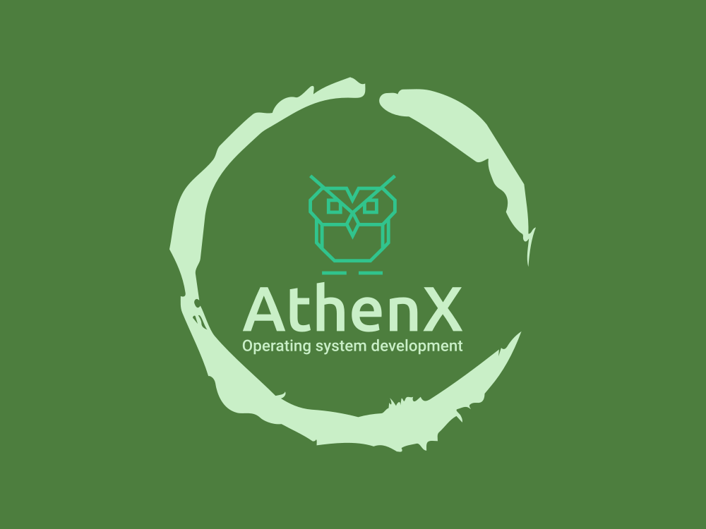

<!-- [![Contributors][contributors-shield]][contributors-url]
[![Forks][forks-shield]][forks-url]
[![Stargazers][stars-shield]][stars-url]
[![Issues][issues-shield]][issues-url]
[![MIT License][license-shield]][license-url]
[![LinkedIn][linkedin-shield]][linkedin-url] -->
<!-- [![GNU License][license-shield]][license-url] -->

<div align="center">
  <a href="https://github.com/KingVentrix007/AthenX-2.0">
    
  </a>

  <h1 align="center">AthenX</h1>

  <p align="center">
    A super simple 32 bit operating system
    <br />
    <a href="https://github.com/KingVentrix007/AthenX-2.0"><strong>Explore the docs »</strong></a>
    <br />
    <br />
    <a href="https://github.com/KingVentrix007/AthenX-2.0">View Demo</a>
    ·
    <a href="https://github.com/KingVentrix007/AthenX-2.0/issues">Report Bug</a>
    ·
    <a href="https://github.com/KingVentrix007/AthenX-2.0/pulls">Request Feature</a>
  </p>
</div>

### Overview

 AthenX is an open source 32-bit hobby operating system. It is designed to be simple to use and understand.It is purely a command line OS and is monotasking only.

##

### History

I started AthenX at the beginning of 2023 or mid to late 2022 (I took a pause in OS development and have lost the source code to my original project), since then I have re-uploaded it to github
( due to me not reading the github manual).

### What AthenX is

AthenX is and probably always will be a hobby OS, I started it to broaden my coding horizons and so that I can say I have done it.

### What AthenX is not

AthenX is not and NEVER will be a replacement for a "real" os, it is simply here to learn.

## Getting Started

### Prerequisites

* grub

     ```sh
  sudo apt install grub-common
  ```
     ```sh
  sudo apt install grub-pc-bin
  ```

* nasm
    ```sh
  sudo apt install nasm
  ```

* gcc

     ```sh
  sudo apt install gcc
  ```

* qemu

     ```sh
  please just google this part then tell me what you did. I cant figure out how I installed qemu
  ```

* xorriso

     ```sh
  sudo apt install xorriso
  ```

### Installation

1. Clone repo

    ```sh
   git clone https://github.com/KingVentrix007/AthenX-2.0.git
   ```

2. open freshly installed repository with wsl or any other UNIX system and run:

    ```sh
    make run
3. From this point on you only have to type

    ``` sh
    make run
    ```

    in order to run the iso

### Modifying

Simply add any changes you want then and save them, then type 'make run' and watch you change come to life (or not).

## Roadmap
* Each update changes this Roadmap, something that worked before a commit might not work after the commit.

* [X] Boot with GRUB
* [X] VGA mode 13h
* [X] VESA/VBE graphics driver
* [X] Basic keyboard driver
* [X] Basic IDE hard drive driver
* [X] Custom filesystem called Algea-fs, Greek goddess of pain and sorrows(!deprecated),
  * [X] make file
  * [X] delete file
  * [x] list files
  * [x] read files
  * [ ] edit files
  * [X] make dictionary
  * [ ] rename dictionary
  * [X] delete dictionary
  * [X] set current dictionary
  * [ ] different file types
  * [X] super basic superblock
  * [X] format disk function
* [X] basic login function
* [X] FAT 12/16/32
* [X] Basic program loading
* [X] Basic system calls (implemented as needed)
* [X] basic text editor
* [x] [x] Start [**`libc`**](docs/Manuals+roadmaps/libc.md#introduction) (functions implemented as needed)
* [ ] Full Libc
* [ ] Port some games
* [ ] Make some games
* [ ] network drivers
* [ ] Apps
  * [ ] web browser
  * [ ] chat application
  * [ ] Basic utility apps

## Contributing

Contributions are what make the open source community such an amazing place to learn, inspire, and create. Any contributions you make are **greatly appreciated** even if i don't add it to the main project.

If you have a suggestion that would make this better, please fork the repo and create a pull request. You can also simply open an issue with the tag "enhancement".
Don't forget to give the project a star! Thanks again!

1. [Read this](https://github.com/KingVentrix007/AthenX-2.0/blob/main/docs/Contributing.md)
2. [Read this](https://github.com/KingVentrix007/AthenX-2.0/blob/main/docs/Terminology.md)
3. Fork the Project
4. Create your Feature Branch (`git checkout -b feature/AmazingFeature`)
5. Commit your Changes (`git commit -m 'Add some AmazingFeature'`)
6. Push to the Branch (`git push origin feature/AmazingFeature`)
7. Open a Pull Request

## License

1. This `README.md` is distributed under the MIT License. See `OtherLicenses/MIT.txt` for more information.
2. This operating system is protected by the `GNU General Public License v3.0`, if you use, redistribute, re-upload or share this code you have to comply with `GNU General Public License v3.0` and any other Licenses specified within the source code files.
3. Licenses specific to files will be stored in the `OtherLicenses` folder
4. If i have missed any copyright licenses, **Please tell me** and i will try to fix it as soon as possible

## Acknowledgments

I would like to say thank you to people and websites that have helped me learn about OS development

* [araujo88 / primus-os](https://github.com/araujo88/primus-os/tree/main): I used his project as a model to learn from
* [GitHub](https://github.com/): Free code
* [othneildrew
/
Best-README-Template](https://github.com/othneildrew/Best-README-Template) This README
* [OsDev.org](https://wiki.osdev.org/Main_Page): Lots if informative pages and articles
* [Logo.com](https://app.logo.com/): They made my logo, and it was free
* And anyone else that I have missed, thanks.
* [OS](https://github.com/pritamzope/OS): I used A LOT of his code, ATA driver, VESA, FPU, etc
* My mom:  she did all my editing and made sure my grammar was correct
* [Incon8](https://icons8.com/):The smaller logos

## Images

<!-- [contributors-shield]: https://img.shields.io/github/contributors/othneildrew/Best-README-Template.svg?style=for-the-badge
[contributors-url]: https://github.com/othneildrew/Best-README-Template/graphs/contributors
[forks-shield]: https://img.shields.io/github/forks/othneildrew/Best-README-Template.svg?style=for-the-badge
[forks-url]: https://github.com/othneildrew/Best-README-Template/network/members
[stars-shield]: https://img.shields.io/github/stars/othneildrew/Best-README-Template.svg?style=for-the-badge
[stars-url]: https://github.com/othneildrew/Best-README-Template/stargazers
[issues-shield]: https://img.shields.io/github/issues/othneildrew/Best-README-Template.svg?style=for-the-badge
[issues-url]: https://github.com/othneildrew/Best-README-Template/issues
[license-shield]: https://img.shields.io/github/license/othneildrew/Best-README-Template.svg?style=for-the-badge
[license-url]: https://github.com/othneildrew/Best-README-Template/blob/master/LICENSE.txt
[linkedin-shield]: https://img.shields.io/badge/-LinkedIn-black.svg?style=for-the-badge&logo=linkedin&colorB=555
[linkedin-url]: https://linkedin.com/in/othneildrew
[product-screenshot]: images/screenshot.png
[Next.js]: https://img.shields.io/badge/next.js-000000?style=for-the-badge&logo=nextdotjs&logoColor=white
[Next-url]: https://nextjs.org/
[React.js]: https://img.shields.io/badge/React-20232A?style=for-the-badge&logo=react&logoColor=61DAFB
[React-url]: https://reactjs.org/
[Vue.js]: https://img.shields.io/badge/Vue.js-35495E?style=for-the-badge&logo=vuedotjs&logoColor=4FC08D
[Vue-url]: https://vuejs.org/
[Angular.io]: https://img.shields.io/badge/Angular-DD0031?style=for-the-badge&logo=angular&logoColor=white
[Angular-url]: https://angular.io/
[Svelte.dev]: https://img.shields.io/badge/Svelte-4A4A55?style=for-the-badge&logo=svelte&logoColor=FF3E00
[Svelte-url]: https://svelte.dev/
[Laravel.com]: https://img.shields.io/badge/Laravel-FF2D20?style=for-the-badge&logo=laravel&logoColor=white
[Laravel-url]: https://laravel.com
[Bootstrap.com]: https://img.shields.io/badge/Bootstrap-563D7C?style=for-the-badge&logo=bootstrap&logoColor=white
[Bootstrap-url]: https://getbootstrap.com
[JQuery.com]: https://img.shields.io/badge/jQuery-0769AD?style=for-the-badge&logo=jquery&logoColor=white
[JQuery-url]: https://jquery.com  -->
<div align="center">
  <a href="https://github.com/othneildrew/Best-README-Template">
    
  </a>
  <div align="center">
  <a href="https://github.com/othneildrew/Best-README-Template">
    
  </a>
<div align="center">
  <a href="https://github.com/othneildrew/Best-README-Template">
    
  </a>

# VERSION 2.0

<div align="center">
  <a href="https://github.com/othneildrew/Best-README-Template">
    
  </a>
  <div align="center">
  <a href="https://github.com/othneildrew/Best-README-Template">
    
  </a>
<div align="center">
  <a href="https://github.com/othneildrew/Best-README-Template">
    
  </a>
